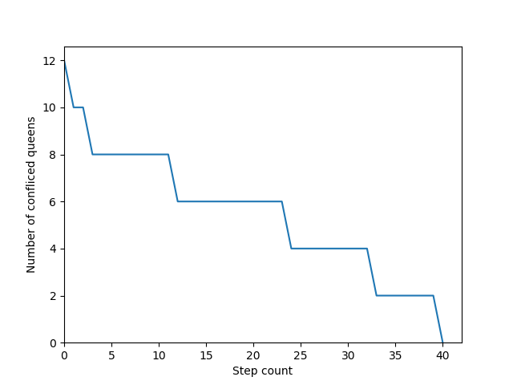
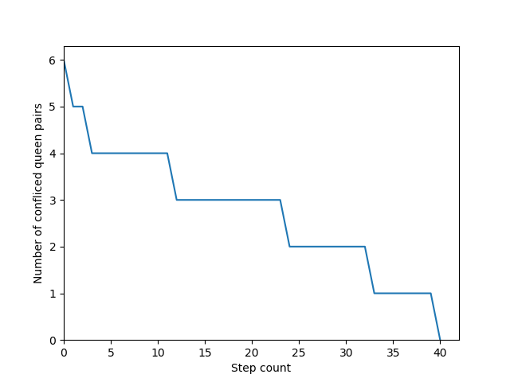
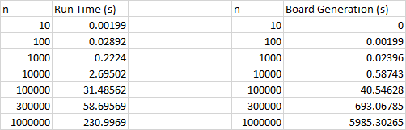
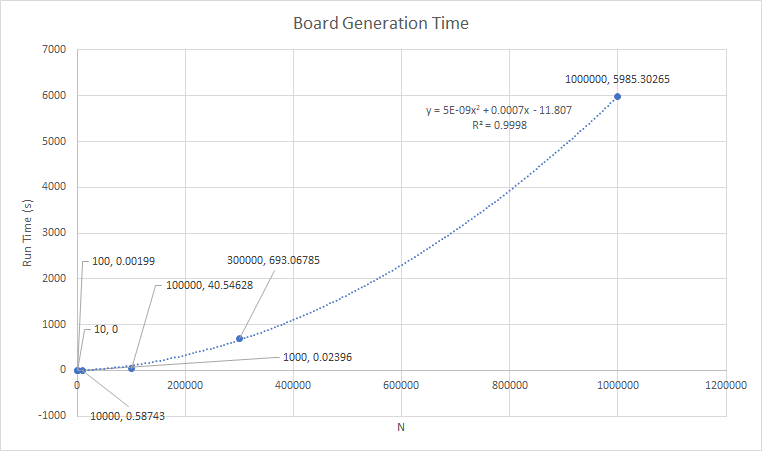
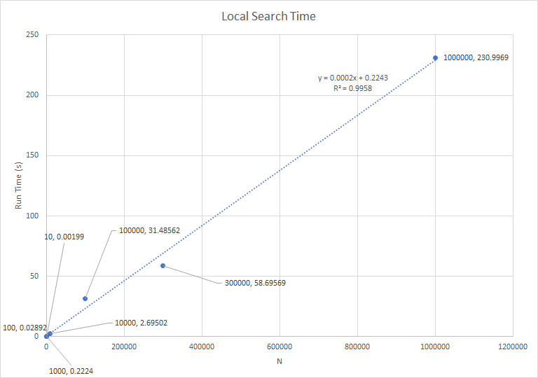

# nQueens using Local Search

## Setup

### Install
requires python >=3.6

install requirements
```
pip install -r requirements.txt
```

### Run

To just run with 8 queens run with
```bash
python n-queens.py
```

if you want to use a specific amount of queens use
```bash
python n-queens.py -n [number of queens]
```

## Design and Implementation choices

We used structures like numpy arrays and dictionaries to improve performance. We also created two classes
One called Queen which contains two variables; row and col for the row and column value respectively. And
Puzzle which contains an array of type Queen which contains all the queens on the belonging to the current
board state named ’queens’ an array of type queens which contains all the queens currently attacking another
queen and a count of all attacking pairs of queens.

### Design
1. When initializing a random board state we designed it in such a way that the next queen will be placed in
one of the rows that will cause the least amount of conflicting queens (row will be chosen randomly among
minimums if there’s multiple).
2. After initialization, we count conflicting pairs of queens and store it in the Puzzle object as a variable.
3. From there we check if the board is solved. If it is a solution, ie no conflicting queens exist, the board
state is printed (for small N-values) and the user is informed a solution has been found. If the board state
after generation is not a solution we call the local search algorithm.
4. The local search algorithm takes in 3 parameters; the puzzle in its current state, the maximum number of
steps you would like to the algorithm to run for. And the value of N of the current board size. From there
the algorithm picks a conflicting queen from the array of conflicting queens and finds the possible positions
to move that queen that will cause the minimum conflicts (if there is multiple minimums we pick randomly ).
5. If a local minimum occurs we save the position of all the conflicting queens and force the program
to find a minimum that does not involve moving a queen to a position it has already visited during this local
minimum, which forces side-ways moves in a single direction.

### Implementation
1. In order to maintain a linear run time, we had to be careful about how we went about counting
the total amount of conflicts. The algorithm we went with was first to store the queens in an array of
length N. Then in order to count the number of conflicts, we store 3 arrays one of size N that stores
the number of queens in each row, and 2 of size 2N that store the number of queens in each of the
2 diagonals. We then loop through the N queens and increment each of the arrays by 1 as follows,
`row[row of queen]`, `backslashDiagonal[row + col]`, `forwardslashDiagonal[N −row + col]`. Then to count
the total amount of we loop through these arrays and for every element we add `(x(x −1))/2` conflicts to the
total since every queen conflicts with each other which makes it a connected graph. We then use the same
idea to find the minimum conflict spots when trying to move a queen.
2. We also used numpy arrays and operations when ever we could as numpy is super optimized c code
under the hood which would make the array operations we are doing not only easier to do, but also more
efficient.

## Run Times and stats for n=1000000

### The output of the program:
```
python n-queens.py 1000000
Generating board
Progress: 999000/1000000
Board Generated in 5985.30265s
Initial Pairs = 6
BenchMark: 0
Time: 230.99690s
=====================SOLUTION FOUND IN 40 STEPS=====================
Pairs = 0
```

### Graphs for number of queens

The graph for the number of conflicting queens per move:


The graph for the number of pairs of conflicting queens per move:



### Run Times

Raw run times



Board Generation Times O(4e-09n^2)


Local Search Run Times O(0.0002n)

